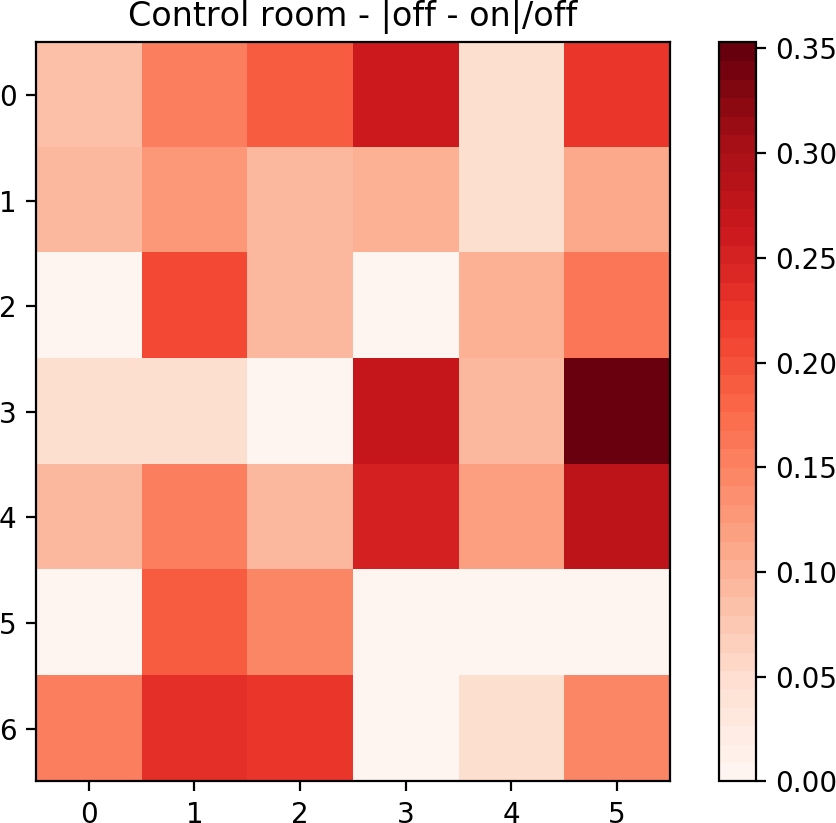

# {.col-1 .theme-minimalist}

## Abstract
Ionizing radiation is commonly used for a wide range of applications, including medical, industrial and academic purposes. As known, exposition to ionizing radiation involves inherent hazard, which must be accounted before, during and after source employment. In this context, facility design specifying shielding requirements represents one of the most important and chronologically initial procedures aimed at achieving adequate radiation protection levels. 
This work resumes the more relevant considerations and actions followed during the design, construction and further characterization of all radiation protection issues involved for the conditioning of a research room, at underground level, devote to operating a 225kVp X-ray source.
Preliminary design was carried out assisted by Monte Carlo simulations performed with the FLUKA main code determining primary/secondary radiation fluences; whereas direct exposure characterization was carried out using calibrated Geiger detectors. The obtained results highlight the reliability of the adapted Monte Carlo subroutine and demonstrate that very good radiation protection levels were achieved for all rooms and sectors were people are present.

# {.col-2}

## Preliminar considerations and design

 

A 25-225 kVp X-ray equipment has been acquired as part of a project mainly supported by the National Science & Tecnology Council (CONICET, Argentina) and the National X-ray System (SNRX, Argentina) with the aim of conducting experiments in the field of radiation physics applied to medicine. The project is intended for research and development mainly in two particular areas: *design and development of a micro-tomography (microCT) facility for non invasive studies on "hard" samples***[1]**, and *dose reinforcement and online monitoring by using Ag and Au nanoparticles***[2]**.

The Faculty (FAMAF, National University of Córdoba, Argentina) provided a room at underground level for conditioning for the research project goals. The underground level and the sourronded soil simplified the calculation of shielding barrier for radioprotection purposes. So the focus on the barriers calculations was not on rooms around but on the researchers working inside the laboratory and the upper level. The initial conditions of the room are shown in Figure 1 (left).

Taking into account irradiation room, facility control room, sample preparation room and shielding barriers a preliminary design was carried out. This design is shown in Figure 1 (right). Here it can be observed control room and sample preparation room separated from the irradiation room by concrete and lead barriers.

 

{height=130mm} &nbsp;&nbsp;
{height=130mm} 
***Figure 1:** room before conditioning (left) and laboratory design (right)*

 

Taking into account the YXLON XPO EVO 225D System with 225 keV maximum energy photon acquired, a FLUKA based Monte Carlo simulation was designed in order to carry out the radiation transport for estimating material and thickness of shielding barriers. Aiming at overestimating calculations, the room was considered as a non controlled area, so transmission coeficients have been calculated in order to obtain no (or minimal) difference in radiation exposure both for X-ray beam turned on and off. Laboratory geometry was performed using \emph{geoviewer} module on \emph{Flair}, the advanced GUI designed for FLUKA. Results can be observed in Figures 2.

 

{height=100mm}
{height=100mm}
***Figure 2:** vertical slice (left, seen from the front of the source) of photon flux in logarithmic color scale and vertical slice (right, seen from on side of the source) of photon flux in logarithmic color scale*

 

Then, it was determined a combination of concrete and PB for the construction of shielding barriers. Two barriers in trap way (see Figure 1) of 40 cm of concrete were defined separating the source room from de the sample preparation room, and a barrier of 60 cm of concrete plus 4mm of Pb was setted aimed at shielding the control room. For the ceiling was stablished a 60 cm concrete barrier and the others were left in 15 cm of concrete because they border whith soil.

## Acknowledgments

 

This study was partially supported by the Facultad de Matemática, Astronomía, Física y Computación of the Universidad Nacional de Córdoba through the construction of the bunker and operation zone; CONICET and Sistema Nacional de Rayos X (Ministerio de Ciencia, Tecnología e Innovación Productiva) through the project RX AC08 Res. SACT Nº 080/14; and CONICET and Fundación YPF through the project PIO FYPF 2016-2017 13320150100039CO.

# {.col-2}

## Setting-up

 

Firstly, building efforts were focused on irradiation room shielding (bunker) taking into account a concrete trap system for the X-rays and an extra Pb 4 mm barrier for the control room. Figure 3 shows advances and time evolution of this process.

 

{height=120mm}
{height=120mm}
{height=141mm}
{height=141mm}
{height=141mm} 
***Figure 3:** Construction time evolution*

 

Finally, the laboratory was finished with the construction of the control room dedicated to the control of the experiments in safe conditions, and the sample preparation room prepared for gel, organic and biological samples storing and tunning up. 

The construction took almost a year and nowadays the laboratory tunning is in its final stage of radiation protection characterization. The experimental set up for the two research projects is in process and researchers estimate it will be fineshed by March 2019.

## Testing and characterization

Measurements have been carried out with a Geiger counter outside the bunker, in the control and sample preparation rooms. In both cases, a grid of positions was defined with the aim of establishing a 2D dose map at a distance of 1 m from the floor. 

The measurements were made both for the equipment turned off and for the X-ray on. For the second case a 200 keV - 4 mA configuration was set, in order to consider the normal extreme case of X-ray beamline working. The absolute difference between measurements was calculated and divided by the background radiation to stablish a relative value.

Figure 4 shows on, off and relative difference measurements and calculations in control room measured in CPM with the Geiger counter, while Figure 5 shows this results for the sample preparation room.

 

{height=120mm}
{height=120mm}
{height=120mm} 
***Figure 4:** Control room measurements and relative difference in CPM units*

 

{height=100mm}
{height=100mm}
{height=100mm} 
***Figure 5:** Sample preparation room measurements and relative difference in CPM units*

# {.col-1}

## Conclusions {style="--header-color:darkred; --other-color-for-h2-gradient:red;"}

 

* It was possible to design and construct an academic laboratory for a 225 kVp X-Ray source for research purposes by using Monte Carlo simulations for shielding requirements.
* The shielding barriers were tested by measuring radiation exposure, contrasting it against backgraound radiation, by using a Geiger counter and results show no considerable exposure in areas of interest, giving indistinguishable values with the background (source turned off) radiation.
* FLUKA Monte Carlo code is shown as an accurate tool for shielding barriers calculations, and *geoviewer* module of *Flair* resulted in a useful tool for this tipe of desgins.

# {.col-2 .theme-minimalist}

## More information

|  |             |
|:--------:|:-----------:|
|  liifamirx.famaf.unc.edu.ar   famaf.unc.edu.ar/~pperez1   `pedro.perez@unc.edu.ar`  |    |

# {.col-2}

## References

 

[1] *Non destructive structural assay using X-ray microtomography to estimate mass density differences in rabbit bone samples*. P. Pérez *et al*. Int. J. of Morphol. 34(4):1232-1238, 2016.

[2] *Silver nanoparticles in X-ray biomedical applications*. F. Mattea *et al*. Rad. Phys. Chem. 130:442-450,2017.

# {.col-1}

<small>

 
Download this poster template from: `github.com/pap84/poster-jfmf18`

</small>